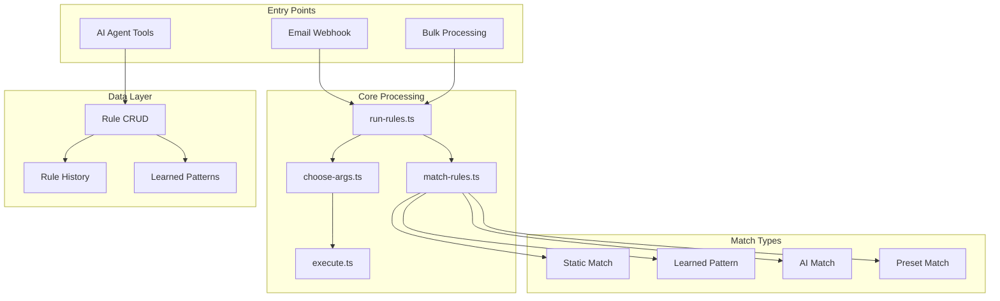

# Rules Engine

The rules engine is the core automation system that processes incoming emails and applies user-defined rules to categorize, label, archive, draft replies, and perform other actions automatically.

## Architecture



## Directory Structure

```
rules/
├── ai/                          # AI-powered rule processing
│   ├── prompts/                 # LLM prompt templates
│   │   ├── create-rule-schema.ts
│   │   ├── diff-rules.ts
│   │   ├── find-existing-rules.ts
│   │   ├── generate-rules-prompt.ts
│   │   └── prompt-to-rules.ts
│   ├── ai-choose-args.ts        # AI argument generation
│   ├── ai-choose-rule.ts        # AI rule selection
│   ├── ai-detect-recurring-pattern.ts
│   ├── bulk-process-emails.ts   # Batch processing
│   ├── choose-args.ts           # Template variable resolution
│   ├── draft-management.ts      # Draft lifecycle
│   ├── execute.ts               # Action execution
│   ├── match-rules.ts           # Rule matching logic
│   ├── run-rules.ts             # Main orchestrator
│   └── types.ts                 # Match type definitions
├── check-sender-rule-history.ts # Sender history lookup
├── consts.ts                    # System rule configurations
├── learned-patterns.ts          # Pattern storage
├── rule-history.ts              # Version tracking
├── rule-to-text.ts              # Human-readable formatting
├── rule.ts                      # CRUD operations
└── types.ts                     # Core type definitions
```

## Core Concepts

### Rule Matching Types

The system supports four types of rule matching:

| Type | Description | Performance |
|------|-------------|-------------|
| **Static** | Exact match on from/to/subject/body fields | Instant |
| **Learned Pattern** | Match against saved sender patterns (groups) | Fast |
| **AI** | LLM evaluates if email matches rule instructions | Slower |
| **Preset** | Built-in detection (e.g., calendar invites) | Fast |

### System Rules

Pre-configured rules for common email categories:

| SystemType | Purpose | Default Action |
|------------|---------|----------------|
| `TO_REPLY` | Emails needing response | Label + Draft |
| `AWAITING_REPLY` | Waiting for others | Label |
| `FYI` | Informational, no action needed | Label |
| `ACTIONED` | Completed conversations | Label |
| `NEWSLETTER` | Subscribed content | Label |
| `MARKETING` | Promotional emails | Label + Archive |
| `CALENDAR` | Meeting invites | Label |
| `RECEIPT` | Purchase confirmations | Label |
| `NOTIFICATION` | System alerts | Label |
| `COLD_EMAIL` | Unsolicited outreach | Label + Archive |

### Conversation Tracking

The system maintains conversation context across email threads:

1. **Meta Rule**: A virtual "Conversations" rule matches all human communication
2. **Status Resolution**: Determines specific status (TO_REPLY, AWAITING_REPLY, FYI, ACTIONED)
3. **Thread Continuity**: Once a thread is tracked, it continues to be tracked

## Data Flow

### Incoming Email Processing

```
1. Email arrives via webhook
   └─> webhooks/process-history-item.ts

2. runRules() orchestrates processing
   ├─> Prepare rules (separate conversation rules)
   ├─> findMatchingRules() evaluates all rules
   │   ├─> Check static conditions (from, to, subject)
   │   ├─> Check learned patterns (groups)
   │   ├─> Check presets (calendar detection)
   │   └─> Call AI if needed (aiChooseRule)
   └─> Execute matched rules
       ├─> getActionItemsWithAiArgs() resolves templates
       ├─> Create ExecutedRule record
       ├─> Schedule delayed actions if any
       └─> executeAct() performs immediate actions
```

### Rule Matching Priority

1. **Cold Email** - Checked first, short-circuits if detected
2. **Learned Patterns** - If matched, skips AI evaluation (optimization)
3. **Static Conditions** - Evaluated with AND/OR operator
4. **AI Instructions** - LLM determines match
5. **Conversation Continuity** - Auto-reapply to threads

## Key Files

### Core Processing

#### `ai/run-rules.ts`
Main orchestrator that coordinates rule execution.

```typescript
export async function runRules({
  provider,
  message,
  rules,
  emailAccount,
  isTest,
  modelType,
  logger,
  skipArchive,
}): Promise<RunRulesResult[]>
```

Key features:
- Batch timestamp for grouping related actions
- Conversation meta-rule handling
- Delayed action scheduling
- Draft deduplication

#### `ai/match-rules.ts`
Evaluates which rules match an incoming email.

```typescript
export async function findMatchingRules({
  rules,
  message,
  emailAccount,
  provider,
  modelType,
  logger,
}): Promise<MatchingRulesResult>
```

Features:
- Lazy loading of learned patterns and previous rules
- Static regex matching with wildcard support
- OR patterns for email addresses: `@a.com|@b.com`
- Thread continuity enforcement

#### `ai/execute.ts`
Performs the actual actions on emails.

```typescript
export async function executeAct({
  client,
  executedRule,
  message,
  userEmail,
  userId,
  emailAccountId,
  logger,
})
```

### Data Layer

#### `rule.ts`
CRUD operations for rules.

```typescript
export async function createRule({ result, emailAccountId, ... })
export async function updateRule({ ruleId, result, ... })
export async function deleteRule({ emailAccountId, ruleId, groupId })
export async function upsertSystemRule({ name, instructions, ... })
```

Features:
- Risk-based auto-enable (only low-risk rules auto-enabled)
- Label resolution for Gmail/Outlook
- Folder creation for Microsoft

#### `learned-patterns.ts`
Stores sender patterns for faster matching.

```typescript
export async function saveLearnedPattern({ emailAccountId, from, ruleId, ... })
export async function saveLearnedPatterns({ emailAccountId, ruleName, patterns, ... })
```

Handles race conditions with retry logic.

#### `rule-history.ts`
Tracks rule versions for auditing.

```typescript
export async function createRuleHistory({ rule, triggerType })
```

### AI Components

#### `ai/ai-choose-rule.ts`
LLM selects matching rules.

- **Single mode**: Returns one best match
- **Multi mode**: Returns multiple matches with primary flag
- Uses security prompts to prevent prompt injection

#### `ai/ai-choose-args.ts`
Generates content for action templates.

Template syntax: `{{variable}}` or `{{var1: instructions}}`

Example:
```
Input: "Hi {{name}}, {{draft response}}"
Output: "Hi John, Thank you for your inquiry..."
```

#### `ai/ai-detect-recurring-pattern.ts`
Learns which senders consistently match rules.

Criteria for learning:
- 90%+ confidence required
- Service emails (not personal)
- Consistent content type

## Integration Points

### Webhook Processing
```typescript
// webhooks/process-history-item.ts
import { runRules } from "@/features/rules/ai/run-rules";

if (hasAutomationRules && hasAiAccess) {
  const ruleResults = await runRules({ ... });
}
```

### AI Agent Tools
```typescript
// features/ai/rule-tools.ts
export function createRuleManagementTools(options) {
  return {
    getUserRulesAndSettings,
    getLearnedPatterns,
    createRule,
    updateRuleConditions,
    updateRuleActions,
    updateLearnedPatterns,
    updateAbout,
    addToKnowledgeBase,
  };
}
```

### Server Actions
```typescript
// actions/rule.ts
export const createRuleAction = actionClient
  .metadata({ name: "createRule" })
  .inputSchema(createRuleBody)
  .action(async ({ ctx, parsedInput }) => { ... });
```

## Action Types

| ActionType | Description |
|------------|-------------|
| `LABEL` | Apply Gmail label or Outlook category |
| `MOVE_FOLDER` | Move to Outlook folder |
| `ARCHIVE` | Remove from inbox |
| `MARK_READ` | Mark as read |
| `DRAFT_EMAIL` | Create draft reply |
| `REPLY` | Send reply (if enabled) |
| `FORWARD` | Forward to address |
| `SEND_EMAIL` | Send new email |
| `MARK_SPAM` | Mark as spam |
| `CALL_WEBHOOK` | HTTP callback |
| `DIGEST` | Add to daily digest |
| `NOTIFY_USER` | Push notification |
| `NOTIFY_SENDER` | Email cold emailers |

## Testing

Test files provide comprehensive coverage:

| Test File | Lines | Coverage |
|-----------|-------|----------|
| `run-rules.test.ts` | ~680 | Orchestration, conversation handling |
| `match-rules.test.ts` | ~2700 | All matching scenarios |
| `choose-args.test.ts` | - | Template resolution |
| `draft-management.test.ts` | - | Draft lifecycle |
| `learned-patterns.test.ts` | - | Pattern storage |

Run tests:
```bash
bun test rules
```

## Error Handling

- All database operations wrapped with `withPrismaRetry`
- AI calls have retry logic with exponential backoff
- Errors logged with scoped loggers
- Failed actions update ExecutedRule status to `ERROR`
- Continues processing other emails on individual failures

## Security

- AI prompts include `PROMPT_SECURITY_INSTRUCTIONS` to prevent injection
- Plain text output instructions prevent XSS
- Risk assessment for auto-enabling rules
- Only low-risk actions auto-enabled (no REPLY/SEND_EMAIL)

## Performance Optimizations

1. **Learned Patterns** - Skip AI for known senders
2. **Lazy Loading** - Groups and previous rules loaded on demand
3. **Thread Continuity** - Reuse previous rule decisions
4. **Batch Timestamps** - Group related executions
5. **Economy Model** - Use cheaper model for bulk processing

## Database Models

```prisma
model Rule {
  id                  String
  name                String
  instructions        String?      // AI matching criteria
  from, to, subject   String?      // Static conditions
  conditionalOperator LogicalOperator
  enabled             Boolean
  runOnThreads        Boolean
  systemType          SystemType?
  actions             Action[]
  group               Group?       // Learned patterns
}

model ExecutedRule {
  id          String
  status      ExecutedRuleStatus
  reason      String?
  matchMetadata Json?            // Serialized MatchReason[]
  rule        Rule?
  actionItems ExecutedAction[]
}
```

## Code Quality Assessment

**Status: Production Ready**

Strengths:
- Comprehensive TypeScript types
- Zod validation on all inputs
- Detailed logging with request IDs
- Error tracking via Sentry
- Race condition handling
- Retry logic for transient failures

Minor Notes:
- `consts.ts` line 273: Placeholder `if (false)` (intentional, for future use)
- Some `as any` casts in integration code (acceptable for provider flexibility)
